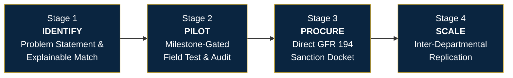
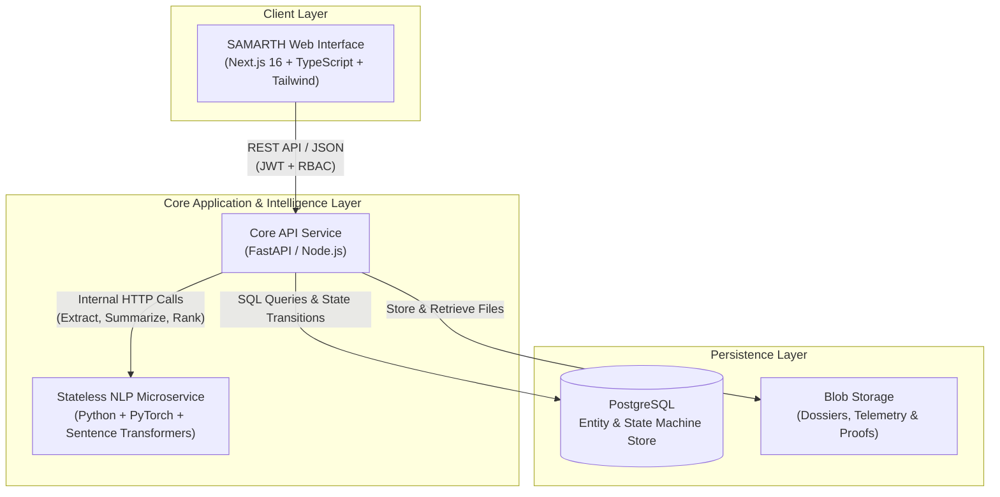
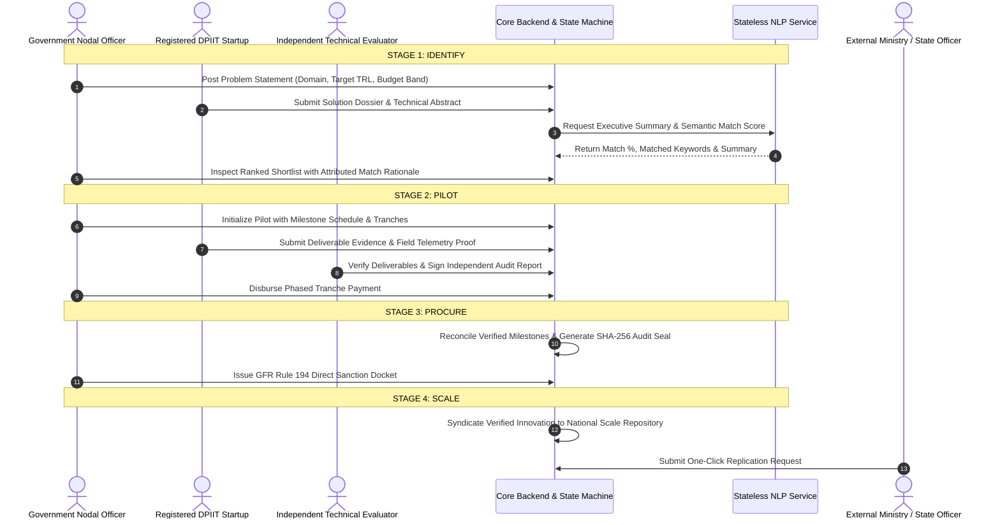

<div align="center">


# SAMARTH
### Public Procurement Lifecycle Engine for Startups and Government Entities

*Smart India Hackathon 2026 · Problem Statement ID: `SIH26136`*

[](https://nextjs.org/)
[](https://fastapi.tiangolo.com/)
[](https://python.org/)
[](https://postgresql.org/)
[](https://doe.gov.in/)
[](https://www.startupindia.gov.in/)

</div>

---

## 1. The Core Challenge & The SAMARTH Solution

Government ministries and public sector undertakings encounter pressing operational and technological challenges. While thousands of agile, DPIIT-recognized startups build cutting-edge solutions for these exact domains, traditional public procurement frameworks present insurmountable barriers:
- Requirement of **3+ years of audited commercial balance sheets**.
- Multi-crore prior turnover mandates.
- Open-ended, high-risk tender contracts that favor large legacy vendors over agile innovators.

**SAMARTH** establishes an institutional, transparent bridge governed under **General Financial Rules (GFR Rule 194)**. It shifts public procurement from speculative open-ended tenders to a structured, milestone-governed progression:



- **Identify:** Government departments publish operational problem statements; startups submit technical proposals; explainable semantic AI ranks submissions and highlights key matching capabilities.
- **Pilot:** Shortlisted startups enter a time-boxed, phased field trial. Capital disbursals occur only when independent evaluators verify concrete deliverables.
- **Procure:** Successfully verified pilots bypass repetitive re-tendering, converting directly into official procurement orders under the GFR Rule 194 startup exemption.
- **Scale:** Proven solutions enter a sovereign repository, allowing other central and state departments to replicate verified technology with a single click.

---

## 2. System Architecture

The SAMARTH platform operates as a decoupled three-tier architecture:



### Architectural Principles
1. **Frontend Isolation:** The frontend never communicates directly with the NLP microservice or database; all interactions flow through the backend API.
2. **Stateless Intelligence:** The NLP microservice is completely stateless. It accepts text/PDF binaries, runs inference, and returns structured data without maintaining database state.
3. **Persisted AI State:** The backend stores NLP extraction tags and semantic scores in PostgreSQL; page loads and searches read persisted records without repeated inference calls.
4. **Independent Auditability:** Pilot milestone verification requires an independent evaluator role, separating problem creators from validators to prevent conflicts of interest.

---

## 3. Four-Stage Lifecycle Workflow



---

## 4. Role-Based Access Control (RBAC)

SAMARTH provides tailored interfaces and strict role segregation across four operational personas:

| Capability | Startup (`startup`) | Government Officer (`govt_officer`) | Independent Evaluator (`evaluator`) | Platform Administrator (`admin`) |
|---|:---:|:---:|:---:|:---:|
| **Browse Problem Statements** | Full Access | Full Access | Full Access | Full Access |
| **DPIIT Profile & Credential Vault** | Edit / Upload | View | View | View |
| **Post Operational Needs** | — | Create / Edit | View | Manage |
| **Shortlist & AI Rationale Inspection**| — | Full Access | Full Access | Full Access |
| **Technical Rubric Scoring** | — | View | Score (0–100) | Manage |
| **Milestone Deliverable Submission** | Upload Proof | View | View | View |
| **Independent Milestone Validation** | — | View | Approve / Reject | Audit |
| **Milestone Tranche Disbursal** | View Status | Disburse Funds | — | Disburse Funds |
| **GFR Rule 194 Sanction Release** | View Status | Issue Order | View Audit | Full Access |
| **Inter-Departmental Replication** | View Directory | Request Adoption | View Directory | Manage |

---

## 5. Repository Structure

```
.
├── frontend/             # Next.js 16 Civic Editorial Web Application
│   ├── app/              # App Router routes (Auth, Gov Dashboard, Startup Dashboard)
│   ├── components/       # Domain, layout, and sovereign UI primitives
│   ├── lib/              # Unified API client, session management, and seed data
│   ├── public/           # Bespoke civic SVGs, emblems, and icons
│   └── README.md         # Dedicated frontend architecture and design documentation
│
├── backend/              # FastAPI Core REST API Service
│   └── README.md         # Backend setup and endpoint documentation
│
├── nlp/                  # Python NLP & Semantic Intelligence Microservice
│   └── README.md         # NLP pipelines, models, and inference documentation
│
└── docs/                 # Architectural specifications and governance guides
```

---

## 6. Service Directory Overview

### 6.1 Frontend (`frontend/`)
- Built with **Next.js 16 (App Router)**, **TypeScript**, and **Tailwind CSS**.
- Follows the **Civic Editorial Design System**: high-contrast serif typography (`Fraunces`), parchment backgrounds (`#FBF9F5`), and sovereign accents (`#0A2540`, `#D4AF37`, `#138808`).
- For detailed UI architecture, component structure, and routing maps, refer to the [Frontend README](./frontend/README.md).

### 6.2 Backend (`backend/`)
- RESTful service handling authentication, RBAC enforcement, PostgreSQL persistence, and pilot state machine transitions.
- Enforces strict transition validation (`Proposed` ──▶ `Under review` ──▶ `Approved` ──▶ `Active` ──▶ `Completed` ──▶ `Procured`).

### 6.3 NLP Microservice (`nlp/`)
- Independent Python microservice hosting three key pipelines:
  - **`/extract`**: PDF capability ingestion, NER, and zero-shot sector classification.
  - **`/summarize`**: Abstract condensation for rapid executive review.
  - **`/rank`**: Cosine similarity matching between ministry problem statements and startup proposals with keyword attribution.

---

## 7. Quick Start (Frontend Development)

To run the SAMARTH frontend application locally:

### Prerequisites
- **Node.js:** `v18.17.0` or later
- **npm:** `v9.0.0` or later

### Installation & Execution
```bash
# 1. Enter the frontend workspace
cd frontend

# 2. Install dependencies
npm install

# 3. Launch the development server
npm run dev
```

Open [http://localhost:3000](http://localhost:3000) (or `http://localhost:3001` if port 3000 is in use).

### Verification & Production Build
```bash
cd frontend
npm run build
```

---

## 8. Sovereign Compliance & Governance

- **General Financial Rules (GFR Rule 194):** Facilitates direct procurement of innovative products and services from startups that have successfully completed structured pilot trials without mandatory prior turnover or past experience prerequisites.
- **DPIIT Startup India Framework:** Real-time verification of startup credentials, DPIIT registration numbers, and turnover bands.
- **Cryptographic Audit Trail:** All critical governance actions (rubric scoring, milestone verification, tranche disbursal, and sanction issuance) generate timestamped, tamper-evident SHA-256 digital audit records.

---

<div align="center">


<p><b>SAMARTH Platform · Smart India Hackathon 2026</b></p>
<p><i>Sovereign Digital Innovation Infrastructure for Public Procurement</i></p>

</div>
