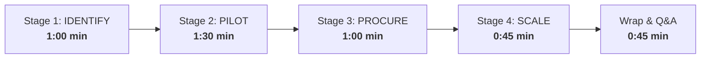

# SAMARTH — 5-Minute Golden Demo Runbook & Walkthrough

**Audience:** Pitch Presenters, Hackathon Judges, Department Evaluators  
**Problem Statement:** Smart India Hackathon 2026 — `SIH26136`  
**Standard Compliance:** GFR Rule 194 & DPIIT Startup Procurement Framework  
**Demo Duration:** 5 Minutes (Strict)  

---

## 1. Executive Setup & Persona Quick-Switcher

SAMARTH includes a zero-friction **Persona Quick-Switcher** directly in the top header (`TopHeader.tsx`). You never need to manually type credentials during a live pitch.

```
┌─────────────────────────────────────────────────────────────────────────────────────────────────┐
│  [SAMARTH EMBLEM]  SAMARTH · Public Procurement Lifecycle       [ 👤 Active: Dr. A. Sharma ▼ ]  │
└─────────────────────────────────────────────────────────────────────────────────────────────────┘
```

### Pre-Seeded Personas

| Persona | Name | Organization & Role | Key Action in Demo |
|---|---|---|---|
| **Govt Officer** | **Dr. A. Sharma** | ICAR — Division of Precision Agriculture (`govt_officer`) | Shortlists solutions, sets up pilot, disburses tranches, releases sanction |
| **Startup Founder** | **Vikram Mehta** | AeroKisan Technologies Pvt Ltd (`startup`, DPIIT: `DIPP98234`) | Auto-extracts capabilities, submits proposal, uploads milestone proof |
| **Independent Evaluator** | **Prof. K. Rao** | IIT Delhi — Autonomous Robotics (`evaluator`) | Scores technical rubric, signs independent verification audit |

---

## 2. The 5-Minute Golden Pitch Flow



---

### [0:00 – 1:00] Stage 1: IDENTIFY (Discovery & Semantic Match)

#### Narrative Hook
> *"In India, over 100,000 DPIIT startups exist, yet less than 1% win direct government procurement orders. Why? Because traditional tenders demand ₹5 Crore prior turnover and 3 years of audited balance sheets. SAMARTH operationalizes General Financial Rules (GFR Rule 194) to eliminate this barrier through a 4-stage verified pipeline."*

#### Click-Through Path
1. **Navigate to:** `http://localhost:3000` (or `3001`).
2. **Observe:** The Civic Editorial landing page detailing the sovereign mandate and 4 stages.
3. **Switch Persona to:** `Dr. A. Sharma (ICAR)`. Click **"Open Government Workspace"** (redirects to `/gov/problems`).
4. **Point to:** Problem statement **`PRB-2026-081: Sub-Surface Canal Seepage Detection UAVs`**.
5. **Click:** **"Review Submissions & AI Ranking"** ──▶ opens `/gov/problems/prob-001/shortlist` (Hero Screen 1).
6. **Key Talking Points:**
   - Note the **"94% Match Score"** on AeroKisan Technologies.
   - Show the **Attributed Keywords**: `autonomous control`, `real-time edge inference`, `SWIR sensors`.
   - Emphasize that the AI is explainable: the officer sees *why* it matched the technical parameters of the problem.
7. **Switch Persona to:** `Vikram Mehta (AeroKisan)`.
8. **Navigate to:** `/startup/profile`. Show the DPIIT verification badge (`DIPP98234`) and auto-extracted technical tags generated from their field PDF.

---

### [1:00 – 2:30] Stage 2: PILOT (Time-Boxed Milestone Governance)

#### Narrative Hook
> *"A government department cannot gamble crores on an unproven startup. Instead of an open-ended tender, SAMARTH binds them into a phased, milestone-gated pilot where money only flows when independent evaluators verify field data."*

#### Click-Through Path
1. **Switch Persona back to:** `Dr. A. Sharma (ICAR)`.
2. **On the Shortlist Page (`/gov/problems/prob-001/shortlist`):**
   - Click **"Initiate Pilot Project"** on AeroKisan's card.
   - The **Pilot Setup Panel** slides open:
     - 3 Milestones are configured:
       1. *Sensor Integration & Benchmarks* (25% tranche · ₹7,12,500)
       2. *50km Canal Corridor Field Trials* (40% tranche · ₹11,40,000)
       3. *NIC Water Portal Telemetry API Sync* (35% tranche · ₹9,97,500)
     - Lead Officer: `Dr. A. Sharma`
     - Independent Validator: `Prof. K. Rao (IIT Delhi)`
   - Click **"Generate Pilot Agreement & Initialize Tracker"**.
3. **Navigate to:** `/gov/pilots/plt-2026-001` (Hero Screen 2: Pilot Tracker).
4. **Demonstrate Milestone Verification:**
   - Look at Milestone 2 (*Field Validation Across 50km Irrigation Network*). Notice the startup has uploaded deliverable telemetry.
   - **Switch Persona to:** `Prof. K. Rao (IIT Delhi)`.
   - As the independent evaluator, click **"Verify Deliverable"**.
   - The **Independent Validation Drawer** opens:
     - Review the raw GPS/telemetry report link.
     - Note the verification remarks: *"Ground truth confirmed seepage at KM 12.4 with 3.8cm/px GSD."*
     - Click **"Approve & Sign Milestone Audit"**.
   - Notice the milestone status turns to **Verified** with an official green seal.
5. **Demonstrate Tranche Disbursal:**
   - **Switch Persona to:** `Dr. A. Sharma (ICAR)`.
   - Click **"Disburse Tranche (₹11,40,000)"**.
   - The tranche is marked disbursed with a real-time timestamp.

---

### [2:30 – 3:30] Stage 3: PROCURE (Direct Sanction under GFR Rule 194)

#### Narrative Hook
> *"Once all pilot milestones are verified by an independent third party, GFR Rule 194 permits direct single-source procurement without re-tendering. SAMARTH compiles the complete proof trail into an immutable civic sanction docket."*

#### Click-Through Path
1. **On Pilot Tracker (`/gov/pilots/plt-2026-001`):**
   - Click the prominent gold banner: **"Proceed to Direct Procurement (GFR Rule 194)"** ──▶ opens `/gov/pilots/plt-2026-001/procure` (Hero Screen 3).
2. **Inspect the Sanction Docket View:**
   - Highlight the **GFR Rule 194 Compliance Seal** (Startup Pilot Direct Exemption).
   - Point out the **Cryptographic SHA-256 Audit Stamp** (`SHA256:7f83b1657ff1...`).
   - Highlight the complete ledger breakdown: Milestone 1, 2, and 3 tranches reconciled to ₹28,50,000.
3. **Action:** Click **"Release Official Sanction Order"**.
   - A confirmation modal pops up with official civic confirmation.
   - Status updates to **Procured**, recording the sanction order reference `SANCTION-ICAR-2026-049`.
   - Click **"Print / Export Docket"** to show print-ready civic styling.

---

### [3:30 – 4:15] Stage 4: SCALE (Multi-Department Replication)

#### Narrative Hook
> *"If ICAR proved that AeroKisan's drones detect canal leaks, why should the Water Resources Department in Odisha spend two years running the exact same test? SAMARTH enables one-click inter-departmental replication."*

#### Click-Through Path
1. **Navigate to:** `/gov/scale` (Hero Screen 4: National Scaling Repository).
2. **Observe:** The curated catalog of verified, procured solutions bearing the sovereign green seal.
3. **Locate:** **AeroScan SWIR: Drone-Based Multi-Spectral Seepage Analytics**.
4. **Click:** **"Initiate Replication Request"**.
5. **The Replication Modal Opens:**
   - Requesting Department: `Department of Water Resources, Govt of Odisha`
   - Requesting Officer: `S. Patnaik (Superintending Engineer)`
   - Target Site: `Mahanadi Delta Canal Network, Cuttack`
   - Target Units: `6 Units`
   - Target Budget: `₹18,50,000`
   - Click **"Submit Replication Request"**.
6. **Confirmation:** The request is logged. Odisha adopts a proven technology without re-tendering, saving 18 months and lakhs of public funds.

---

### [4:15 – 5:00] Conclusion & Judge Wrap-Up

#### Summary Punchline
> *"SAMARTH transforms public procurement from a slow, risk-averse paper maze into a transparent, milestone-driven engine. We give startups a level playing field, we give officers audit-safe protection under GFR Rule 194, and we give India a national repository of proven civic innovations."*

---

## 3. Emergency Troubleshooting & Reset Guide

### Quick Reset
If you ever want to reset the demo data back to clean initial state:
1. Open browser developer console (`F12`).
2. Run:
   ```javascript
   localStorage.clear();
   location.reload();
   ```
3. Or clear the specific keys:
   ```javascript
   localStorage.removeItem("samarth_store_problems");
   localStorage.removeItem("samarth_store_solutions");
   localStorage.removeItem("samarth_store_pilots");
   localStorage.removeItem("samarth_store_replications");
   localStorage.removeItem("samarth_session_data");
   ```

### Verification Command
To verify that all frontend pages compile cleanly before demo:
```bash
cd frontend && npm run build
```
Target compile time: `< 500ms` with zero TypeScript or lint errors.
