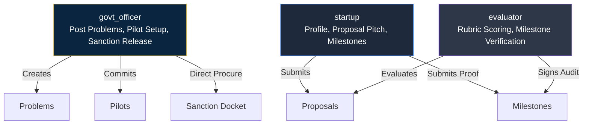
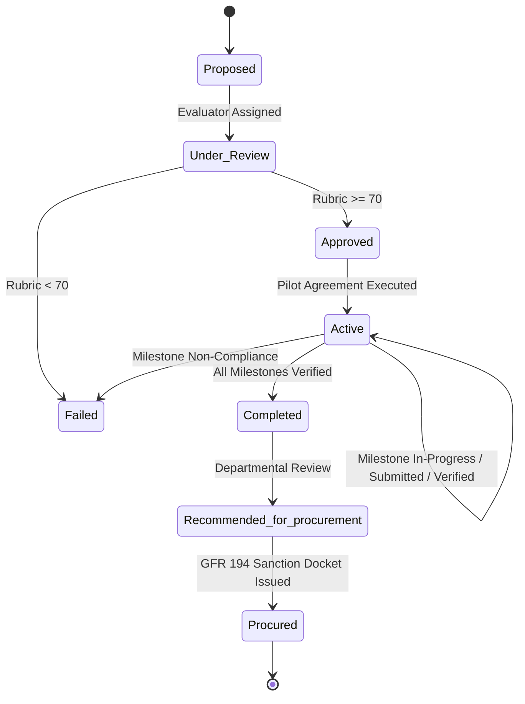

# SAMARTH — Frontend to Backend API Contract

**Version:** 1.0.0  
**Target Backend:** FastAPI / PostgreSQL  
**Client:** Next.js 16 (App Router) + TypeScript  
**Compliance Standard:** General Financial Rules (GFR Rule 194) & DPIIT Startup Procurement Framework  

---

## 1. Overview & Transport Protocol

The frontend client communicates with the backend via a RESTful JSON API. All mutating requests and secured reads require session tokens and role headers.

```
┌───────────────────────────┐         REST / JSON (HTTPS)         ┌───────────────────────────┐
│     SAMARTH Frontend      │ ─────────────────────────────────▶ │      FastAPI Backend      │
│  (Next.js 16 App Router)  │ ◀───────────────────────────────── │    (PostgreSQL Storage)   │
└───────────────────────────┘    Authorization: Bearer <token>    └───────────────────────────┘
```

### 1.1 Base URL & Environment
- **Development Base URL:** `http://localhost:8000/api`
- **Environment Variable:** `NEXT_PUBLIC_API_URL`
- **Character Set & Content-Type:** `UTF-8`, `application/json` (except multipart file uploads)
- **Date/Timestamp Standard:** ISO 8601 strings (`YYYY-MM-DD` or `YYYY-MM-DDTHH:mm:ss.sssZ`)

### 1.2 Global Headers

| Header | Format | Requirement | Description |
|---|---|---|---|
| `Authorization` | `Bearer <jwt_token>` | Required on all `/api/*` (except auth login/signup) | Cryptographically signed session token |
| `Content-Type` | `application/json` | Required for JSON payloads | Omit when sending `multipart/form-data` |
| `X-Request-Id` | `UUIDv4` string | Optional (recommended) | End-to-end request tracing for civic audit trails |

### 1.3 Cookie Convention (Edge Proxy & SSR)
Next.js Edge Proxy (`frontend/proxy.ts`) checks the following HTTP-only / browser cookie to enforce dashboard isolation before page hydration:

- **Cookie Name:** `samarth_session_role`
- **Values:** `"startup"` | `"govt_officer"` | `"evaluator"` | `"admin"`
- **Path:** `/`
- **SameSite:** `Lax`
- **Max-Age:** `86400` (24 hours)

---

## 2. Authentication & Role-Based Access Control (RBAC)

### 2.1 User Roles & Scope



- **`startup`**: Access to startup portal (`/startup/*`). Can view published problems, upload past credentials, submit proposals, track pilots, submit milestone deliverables.
- **`govt_officer`**: Access to government portal (`/gov/*`). Can create problem statements, review ranked proposals, initiate pilots, disburse milestone tranches, issue GFR Rule 194 sanction orders, replicate scale solutions.
- **`evaluator`**: Independent technical evaluator (e.g., IIT/NIT faculty, DRDO/ICAR scientists). Can score proposals via 100-point rubric and submit binding independent milestone verification reports.
- **Separation of Duty Principle:** The backend MUST reject any attempt by the same user ID to both post a problem and perform independent milestone validation on its pilot.

---

## 3. Standard Response & Error Formats

### 3.1 Success Envelope
```json
{
  "success": true,
  "data": { ... },
  "message": "Resource successfully updated."
}
```

### 3.2 Error Envelope
HTTP status codes `400`, `401`, `403`, `404`, `422`, `500` return structured error bodies:
```json
{
  "success": false,
  "error": {
    "code": "INVALID_STATE_TRANSITION",
    "message": "Cannot disburse tranche for milestone 'm-2' because status is 'submitted', not 'verified'.",
    "details": [
      {
        "field": "status",
        "issue": "Milestone must be verified by an independent evaluator prior to fund disbursement."
      }
    ]
  }
}
```

---

## 4. API Endpoint Specifications

### 4.1 Authentication (`/api/auth`)

#### `POST /api/auth/login`
Authenticates a user and issues session data + token.
- **Request Body:**
  ```json
  {
    "email": "sharma.icar@gov.in",
    "password": "SecurePassword2026!"
  }
  ```
- **Response `200 OK`:**
  ```json
  {
    "success": true,
    "data": {
      "user": {
        "id": "user-govt-01",
        "name": "Dr. A. Sharma",
        "email": "sharma.icar@gov.in",
        "role": "govt_officer",
        "orgName": "Indian Council of Agricultural Research (ICAR)",
        "department": "Division of Precision Agriculture & Drone Systems",
        "token": "eyJhbGciOiJIUzI1NiIsInR5cCI6IkpXVCJ9..."
      }
    }
  }
  ```

#### `POST /api/auth/signup`
Registers a new startup or government officer.
- **Request Body:**
  ```json
  {
    "name": "Vikram Mehta",
    "email": "vikram@aerokisan.tech",
    "password": "StrongPassword2026!",
    "role": "startup",
    "orgName": "AeroKisan Technologies Pvt Ltd",
    "dpiitNumber": "DIPP98234",
    "turnoverBand": "< ₹1 Cr"
  }
  ```
- **Response `201 Created`:** User session object.

---

### 4.2 Startups & Capability Profiling (`/api/startups`)

#### `GET /api/startups/me`
Retrieves the logged-in startup's profile.
- **Response `200 OK`:**
  ```json
  {
    "id": "user-startup-01",
    "orgName": "AeroKisan Technologies Pvt Ltd",
    "dpiitNumber": "DIPP98234",
    "dpiitVerified": true,
    "domains": ["DroneTech", "AgriTech"],
    "tags": ["Autonomous UAV", "Multispectral Sensors", "SWIR Imaging", "Edge AI"],
    "turnoverBand": "< ₹1 Cr",
    "incorporationDate": "2023-04-12"
  }
  ```

#### `POST /api/startups/upload-past-project`
Uploads past credential PDF. Triggers the backend call to the NLP service (`/extract`).
- **Content-Type:** `multipart/form-data`
- **Form Fields:** `file` (binary PDF, max 15MB)
- **Response `200 OK`:**
  ```json
  {
    "success": true,
    "data": {
      "fileName": "AeroKisan_Punjab_Field_Report_2025.pdf",
      "extractedDomain": "DroneTech",
      "extractedTags": [
        "Computer Vision",
        "Multispectral Imaging",
        "SWIR Sensors",
        "Edge Compute",
        "Autonomous Flight",
        "Encrypted Mesh Telemetry",
        "Thermal Segmentation"
      ],
      "extractedSummary": "Past project demonstrating autonomous UAV survey for crop canal seepage under harsh atmospheric conditions.",
      "estimatedTRL": "TRL-6"
    }
  }
  ```

---

### 4.3 Problems (`/api/problems`)

#### `GET /api/problems`
Retrieves public problem statements. Supports filtering by sector and status.
- **Query Parameters:**
  - `domain`: `AgriTech` | `GovTech` | `Defence` | `HealthTech` | `CleanTech` | `DroneTech`
  - `status`: `open` | `evaluating` | `pilot_active` | `completed`
  - `search`: string keyword
- **Response `200 OK`:**
  ```json
  [
    {
      "id": "prob-001",
      "code": "PRB-2026-081",
      "title": "Sub-Surface Canal Seepage Detection UAVs",
      "department": "Division of Water Resources & Precision Agriculture",
      "ministry": "Ministry of Agriculture & Farmers Welfare",
      "domain": "DroneTech",
      "description": "High-loss canal networks require low-altitude multispectral autonomous UAVs capable of detecting invisible sub-surface seepage zones.",
      "desiredOutcome": "Real-time thermal/multispectral mapping with sub-50ms onboard inference delivering geo-tagged leak coordinates to central dispatch within 4 hours.",
      "budgetBand": "₹25L–₹50L",
      "targetTRL": "TRL-6",
      "deadline": "2026-10-31",
      "createdAt": "2026-09-01",
      "submissionCount": 4,
      "status": "open"
    }
  ]
  ```

#### `POST /api/problems`
Government officers post a new problem statement.
- **Request Body:**
  ```json
  {
    "title": "Autonomous AI Sorting for Municipal Wet Waste",
    "department": "Solid Waste Management Cell",
    "ministry": "Ministry of Housing and Urban Affairs",
    "domain": "CleanTech",
    "description": "Robotic sorting arm with computer vision to separate organic compostable waste from micro-plastics at 120 items per minute.",
    "desiredOutcome": "Achieve 98% purity in organic fraction with operational uptime of > 18 hours daily.",
    "budgetBand": "₹25L–₹50L",
    "targetTRL": "TRL-6",
    "deadline": "2026-11-15"
  }
  ```
- **Response `201 Created`:** Returns created `Problem` object with generated `id`, `code`, `createdAt`, `submissionCount: 0`, `status: "open"`.

---

### 4.4 Solutions & Shortlisting (`/api/problems/:problemId/solutions`)

#### `GET /api/problems/:problemId/solutions`
Retrieves all solutions submitted for a problem, ranked by match score.
- **Response `200 OK`:**
  ```json
  [
    {
      "id": "sol-001",
      "problemId": "prob-001",
      "startupId": "user-startup-01",
      "startupName": "AeroKisan Technologies Pvt Ltd",
      "dpiitNumber": "DIPP98234",
      "dpiitVerified": true,
      "location": "Pune, Maharashtra",
      "title": "AeroScan SWIR: Drone-Based Multi-Spectral Seepage Analytics",
      "abstract": "Turnkey UAV payload combining dual-band SWIR infrared optics with an onboard Jetson Orin Nano edge computer running customized thermal anomaly detection.",
      "claimedTRL": "TRL-6",
      "proposedCost": 2850000,
      "proposedDurationWeeks": 16,
      "submittedAt": "2026-09-04",
      "matchScore": 0.94,
      "matchExplanation": "High semantic similarity to required technical parameters. Identified key capability match on edge compute, low latency, and ruggedized housing.",
      "matchedKeywords": [
        "autonomous control",
        "real-time edge inference",
        "encrypted telemetry",
        "TRL compliance"
      ],
      "pdfUrl": "/uploads/solutions/aeroscan_technical_dossier.pdf",
      "status": "shortlisted",
      "rubricScore": {
        "technicalMerit": 28,
        "costRealism": 18,
        "teamCapability": 19,
        "timelineViability": 27,
        "total": 92
      }
    }
  ]
  ```

#### `POST /api/problems/:problemId/solutions`
Startup submits a solution proposal against an open problem.
- **Request Body (or multipart with PDF):**
  ```json
  {
    "problemId": "prob-001",
    "startupId": "user-startup-01",
    "startupName": "AeroKisan Technologies Pvt Ltd",
    "dpiitNumber": "DIPP98234",
    "dpiitVerified": true,
    "location": "Pune, Maharashtra",
    "title": "AeroScan SWIR: Drone-Based Multi-Spectral Seepage Analytics",
    "abstract": "Turnkey UAV payload combining dual-band SWIR infrared optics with onboard edge compute...",
    "claimedTRL": "TRL-6",
    "proposedCost": 2850000,
    "proposedDurationWeeks": 16,
    "pdfUrl": "https://storage.samarth.gov.in/proposals/sol-001.pdf"
  }
  ```
- **Backend Flow:** Saves solution ──▶ Calls NLP `/summarize` and `/rank` ──▶ Stores `matchScore`, `matchExplanation`, `matchedKeywords` ──▶ Increments `problem.submissionCount`.
- **Response `201 Created`:** Completed `Solution` object.

#### `PUT /api/solutions/:solutionId/rubric`
Evaluator submits scoring rubric (0–100 scale).
- **Request Body:**
  ```json
  {
    "technicalMerit": 28,
    "costRealism": 18,
    "teamCapability": 19,
    "timelineViability": 27
  }
  ```
- **Response `200 OK`:** Updated `Solution` with `rubricScore.total = 92`.

---

### 4.5 Pilots & Milestone Governance (`/api/pilots`)

#### `POST /api/pilots`
Government Officer initiates a Pilot from a shortlisted proposal.
- **Request Body:**
  ```json
  {
    "problemId": "prob-001",
    "solutionId": "sol-001",
    "startupId": "user-startup-01",
    "startupName": "AeroKisan Technologies Pvt Ltd",
    "dpiitNumber": "DIPP98234",
    "dpiitVerified": true,
    "department": "Division of Precision Agriculture & Drone Systems",
    "ministry": "Ministry of Agriculture & Farmers Welfare",
    "leadOfficerName": "Dr. A. Sharma",
    "independentValidatorName": "Prof. K. Rao (IIT Delhi)",
    "durationWeeks": 16,
    "totalBudget": 2850000,
    "milestones": [
      {
        "sequence": 1,
        "title": "Sensor Integration & Lab Telemetry Benchmarks",
        "description": "Bench-test SWIR sensors, integrate with edge flight computer.",
        "targetKPI": "Sensor latency < 40ms; thermal anomaly delta >= 1.5°C verified in lab chamber.",
        "deliverableDueWeek": 4,
        "trancheAmount": 712500,
        "tranchePercentage": 25,
        "status": "pending"
      },
      {
        "sequence": 2,
        "title": "Field Validation Across 50km Irrigation Network",
        "description": "Deploy drone sorties across designated canal corridor in Rohtak.",
        "targetKPI": "98% coverage with sub-5cm spatial resolution; detect >= 3 seepage points.",
        "deliverableDueWeek": 10,
        "trancheAmount": 1140000,
        "tranchePercentage": 40,
        "status": "pending"
      },
      {
        "sequence": 3,
        "title": "NIC Water Portal Telemetry API Integration",
        "description": "Feed automated geo-tagged leak vector files into central dashboard.",
        "targetKPI": "Zero data loss over 72-hour operational run; end-to-end sync < 4 hours.",
        "deliverableDueWeek": 16,
        "trancheAmount": 997500,
        "tranchePercentage": 35,
        "status": "pending"
      }
    ]
  }
  ```
- **Response `201 Created`:** Returns created `Pilot` with generated `id`, `code` (`PLT-2026-012`), `startDate`, and `status: "Active"`.

#### `POST /api/pilots/:id/milestones/:milestoneId/deliverable`
Startup submits proof of completed milestone.
- **Request Body:**
  ```json
  {
    "achievedKPI": "Field telemetry logged across 54km canal corridor; 4 critical seepages mapped with 3.8cm/px GSD.",
    "deliverableFileUrl": "https://storage.samarth.gov.in/pilots/plt-001/m2_telemetry_proof.pdf"
  }
  ```
- **Response `200 OK`:** Updates milestone `status: "submitted"`.

#### `POST /api/pilots/:id/milestones/:milestoneId/verify`
Independent Evaluator validates or rejects deliverable.
- **Request Body:**
  ```json
  {
    "verifiedBy": "Prof. K. Rao (IIT Delhi)",
    "status": "verified",
    "remarks": "Raw geospatial logs verified. GSD measured at 3.8cm/px. Ground truth confirmed seepage at KM 12.4.",
    "verificationReportUrl": "https://storage.samarth.gov.in/pilots/plt-001/m2_iit_eval_report.pdf"
  }
  ```
- **Response `200 OK`:** Milestone becomes `"verified"`. If all milestones are verified, pilot status automatically advances to `"Completed"`.

#### `POST /api/pilots/:id/milestones/:milestoneId/disburse`
Government Officer disburses tranche payment.
- **Request Body:** `{}`
- **Constraint:** Milestone MUST have `status: "verified"`.
- **Response `200 OK`:** Sets `trancheDisbursed: true` and `disbursedAt: "YYYY-MM-DD"`.

---

### 4.6 Direct Procurement & Sanction Docket (`/api/pilots/:id/procure`)

#### `POST /api/pilots/:id/procure`
Generates GFR Rule 194 Direct Sanction Docket from completed pilot data.
- **Preconditions:**
  1. `pilot.status` must be `"Completed"`.
  2. All pilot milestones must be `"verified"` and `trancheDisbursed == true`.
  3. Startup DPIIT registration must be verified.
- **Response `200 OK`:**
  ```json
  {
    "success": true,
    "data": {
      "pilotId": "plt-2026-001",
      "sanctionOrderRef": "SANCTION-ICAR-2026-049",
      "gfrExemptionClause": "GFR Rule 194 (Procurement of Innovative Solutions from Startups without Prior Turnover/Experience)",
      "totalSanctionAmount": 2850000,
      "auditHash": "SHA256:7f83b1657ff1fc53b92dc18148a1d65dfc2d4b1fa3d677284addd200126d9069",
      "issuedAt": "2026-09-11T12:00:00Z",
      "signatory": "Dr. A. Sharma (Nodal Officer, ICAR)"
    }
  }
  ```

---

### 4.7 Scale & Replication Directory (`/api/proven-solutions`)

#### `GET /api/proven-solutions`
Retrieves national catalog of successfully piloted and procured startup solutions.
- **Response `200 OK`:** Array of `ScaleSolution` objects.

#### `POST /api/proven-solutions/replicate`
A different ministry or state department requests direct adoption.
- **Request Body:**
  ```json
  {
    "pilotId": "plt-2026-001",
    "solutionTitle": "AeroScan SWIR: Drone-Based Multi-Spectral Seepage Analytics",
    "startupName": "AeroKisan Technologies Pvt Ltd",
    "originatingDepartment": "Division of Precision Agriculture, ICAR",
    "requestingDepartment": "Department of Water Resources, Govt of Odisha",
    "requestingOfficerName": "S. Patnaik",
    "requestingOfficerEmail": "patnaik.water@odisha.gov.in",
    "targetDeploymentSite": "Mahanadi Delta Canal Network, Cuttack",
    "targetQuantity": 6,
    "targetBudget": 1850000,
    "deploymentTimelineWeeks": 8
  }
  ```
- **Response `201 Created`:** `ReplicationRequest` created with `status: "pending"`.

---

## 5. Pilot State Machine Contract

The backend must strictly enforce the following state transition matrix:



Any API call attempting a disallowed transition (e.g., `Proposed` ──▶ `Procured`) MUST be rejected with HTTP `422 Unprocessable Entity` and error code `INVALID_STATE_TRANSITION`.
