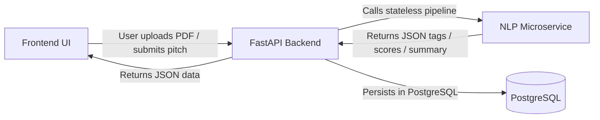

# SAMARTH — NLP / ML Microservice UI Requirements

**Version:** 1.0.0  
**Target Service:** Python FastAPI (Stateless Microservice)  
**Consumer:** Backend Service (which serves Frontend UI)  
**Primary Models:** `all-MiniLM-L6-v2` / `BART-MNLI` / `KeyBERT` / `spaCy`  

---

## 1. Executive Summary & Architectural Scope

The SAMARTH frontend is designed around **explainable, verifiable AI**. Rather than black-box recommendations, the UI explicitly shows the government evaluator and startup *why* a document was tagged, *why* a proposal was ranked high, and *which technical parameters* matched the ministry's problem statement.



### 1.1 Key Principles
1. **Stateless Service:** The NLP service does not connect to PostgreSQL. It takes raw text or PDF binary in, performs inference, and returns JSON.
2. **Synchronous UI Deadlines:** Endpoints must respond within strict latency windows to maintain an interactive civic user experience.
3. **Deterministic & Explainable:** Scores must be accompanied by matched keyword lists and human-readable explanation sentences.

---

## 2. Pipeline 1: Capability & Tag Extraction (`/extract`)

### 2.1 Trigger & Frontend Placement
- **Frontend Screen:** `frontend/app/(dashboard)/startup/profile/page.tsx`
- **UI Component:** `StartupTagList.tsx`
- **User Action:** Startup uploads a past project credential PDF (e.g. proof of past field trial, technical report, patent dossier).
- **UI Presentation:** The frontend displays an interactive tag cloud categorized by **Sector Domain** and **Technical Capability Tags**, allowing the startup to verify or delete incorrect tags before saving.

### 2.2 Endpoint Specification

- **Path:** `POST /extract`
- **Content-Type:** `multipart/form-data`
- **Inputs:**
  - `file`: PDF binary (up to 15MB) OR `text`: string (UTF-8)
  - `target_domains`: Optional array of domains to classify against (defaulting to the 6 sovereign domains).

#### Input Example (FastAPI multipart):
```bash
curl -X POST "http://localhost:8001/extract" \
  -F "file=@aerokisan_punjab_field_trial.pdf"
```

#### Expected JSON Output:
```json
{
  "domain": "DroneTech",
  "confidence": 0.94,
  "tags": [
    "Computer Vision",
    "Multispectral Imaging",
    "SWIR Sensors",
    "Edge Compute",
    "Autonomous Flight",
    "Encrypted Mesh Telemetry",
    "Thermal Segmentation"
  ],
  "skills": [
    "Embedded Linux",
    "YOLOv8",
    "ROS2",
    "Thermal Radiometry",
    "RTK-GNSS"
  ],
  "summary": "Demonstrated field deployment of autonomous multispectral UAV sorties mapping canal seepage across 500 hectares with sub-5cm resolution.",
  "extracted_trl_estimate": "TRL-6"
}
```

### 2.3 Sovereign Domain Taxonomy
The model must classify against these exact domain strings (matching `types.ts`):
- `"AgriTech"`
- `"GovTech"`
- `"Defence"`
- `"HealthTech"`
- `"CleanTech"`
- `"DroneTech"`

### 2.4 Extraction Requirements
- **KeyBERT / spaCy:** Extract 5 to 10 key technical phrases (max 3 words per phrase). Avoid generic business buzzwords (e.g. "scalable", "innovative", "end-to-end"); extract specific technical capabilities (e.g., "SWIR Sensors", "Sub-50ms Latency", "Thermal Segmentation").

---

## 3. Pipeline 2: Executive Solution Summarization (`/summarize`)

### 3.1 Trigger & Frontend Placement
- **Frontend Screen:** `frontend/app/(dashboard)/gov/problems/[id]/shortlist/page.tsx`
- **UI Component:** `RankedSolutionCard.tsx` and `SolutionInspectorDrawer.tsx`
- **User Action:** Triggered when a startup submits a comprehensive solution proposal (often a 10–25 page PDF).
- **UI Presentation:** Displays an **Executive Briefing Card** (2–4 concise sentences) in high-contrast typography, allowing the Joint Secretary or Nodal Evaluator to understand the technical core without opening the full attachment.

### 3.2 Endpoint Specification

- **Path:** `POST /summarize`
- **Content-Type:** `application/json` or `multipart/form-data`
- **Inputs:**
  ```json
  {
    "solution_id": "sol-001",
    "text": "Full extracted text of the proposal document...",
    "max_sentences": 3
  }
  ```

#### Expected JSON Output:
```json
{
  "solution_id": "sol-001",
  "summary": "Dual-sensor SWIR UAV platform with onboard Jetson Orin Nano edge inference for autonomous canal seepage detection, delivering sub-5cm spatial mapping and automated geo-tagged leak vector sync.",
  "technical_claims": [
    "Real-time edge compute (< 50ms latency)",
    "IP67 weatherized airframe for extreme field environments",
    "Direct encrypted mesh telemetry to central server"
  ],
  "cost_timeline_summary": "₹28,50,000 across 16 weeks in 3 phased milestones."
}
```

---

## 4. Pipeline 3: Semantic Match Ranking & Keyword Attribution (`/rank`)

### 4.1 Trigger & Frontend Placement
- **Frontend Screen:** `frontend/app/(dashboard)/gov/problems/[id]/shortlist/page.tsx` (Hero Screen 1)
- **UI Component:** `RankedSolutionCard.tsx`
- **User Action:** Called when solutions for an open problem are retrieved for evaluation.
- **UI Presentation:**
  - Semantic Alignment Ring: Visual percentage (e.g. `94% Match`).
  - Explainability Callout: 1–2 sentence contextual explanation of the match.
  - Attributed Keyword Pills: The specific technical tags common to both the department's need and the startup's proposal.

```
┌────────────────────────────────────────────────────────────────────────┐
│  Rank #1 · 94% Match  │  AeroScan SWIR: Drone-Based Multi-Spectral...  │
├────────────────────────────────────────────────────────────────────────┤
│  AI Match Rationale:                                                   │
│  "Direct alignment on edge compute, low latency, and ruggedized        │
│   sensor housing specifications under harsh field conditions."         │
│                                                                        │
│  Attributed Keywords:                                                  │
│  [ autonomous control ] [ real-time edge inference ] [ encrypted mesh ]│
└────────────────────────────────────────────────────────────────────────┘
```

### 4.2 Endpoint Specification

- **Path:** `POST /rank`
- **Content-Type:** `application/json`
- **Inputs:**
  ```json
  {
    "problem": {
      "id": "prob-001",
      "title": "Sub-Surface Canal Seepage Detection UAVs",
      "description": "High-loss canal networks require low-altitude multispectral autonomous UAVs capable of detecting invisible sub-surface seepage zones.",
      "desired_outcome": "Real-time thermal/multispectral mapping with sub-50ms onboard inference delivering geo-tagged leak coordinates within 4 hours.",
      "domain": "DroneTech",
      "target_trl": "TRL-6"
    },
    "candidates": [
      {
        "solution_id": "sol-001",
        "title": "AeroScan SWIR: Drone-Based Multi-Spectral Seepage Analytics",
        "abstract": "Turnkey UAV payload combining dual-band SWIR infrared optics with an onboard Jetson Orin Nano edge computer running customized thermal anomaly detection...",
        "claimed_trl": "TRL-6"
      },
      {
        "solution_id": "sol-002",
        "title": "AquaSense Satellite SAR Analysis",
        "abstract": "Orbital Synthetic Aperture Radar data processing platform for quarterly soil moisture estimation...",
        "claimed_trl": "TRL-8"
      }
    ]
  }
  ```

#### Expected JSON Output:
```json
{
  "problem_id": "prob-001",
  "results": [
    {
      "solution_id": "sol-001",
      "match_score": 0.94,
      "match_percent": 94,
      "rank": 1,
      "match_explanation": "Direct match on edge compute, low latency, and ruggedized sensor housing specifications under harsh field conditions.",
      "matched_keywords": [
        "autonomous control",
        "real-time edge inference",
        "encrypted telemetry",
        "TRL compliance"
      ],
      "semantic_breakdown": {
        "problem_relevance": 0.96,
        "technical_feasibility": 0.92,
        "operational_alignment": 0.94
      }
    },
    {
      "solution_id": "sol-002",
      "match_score": 0.62,
      "match_percent": 62,
      "rank": 2,
      "match_explanation": "High latency satellite revisit frequency (12 days) fails to satisfy 4-hour leak detection requirement; lack of onboard edge compute.",
      "matched_keywords": [
        "soil moisture",
        "spatial resolution"
      ],
      "semantic_breakdown": {
        "problem_relevance": 0.68,
        "technical_feasibility": 0.74,
        "operational_alignment": 0.44
      }
    }
  ]
}
```

---

## 5. Performance, Latency SLAs & Fallback Strategy

| Pipeline | Target Latency (p50) | Max Timeout | Fallback Behavior on Timeout |
|---|---|---|---|
| `/extract` | < 1,200 ms | 4,000 ms | Regex rule-based keyword match from document title and headers |
| `/summarize` | < 800 ms | 2,500 ms | First 300 characters of abstract with ellipsis |
| `/rank` | < 1,500 ms | 4,000 ms | Word-token TF-IDF overlap calculation |

### 5.1 OCR Fallback for Scanned Documents
- If PDF text extraction yields < 100 characters (indicating a scanned paper document), pipe to Tesseract OCR before running the embedding pipeline.
- Return `"ocr_performed": true` in response metadata.
