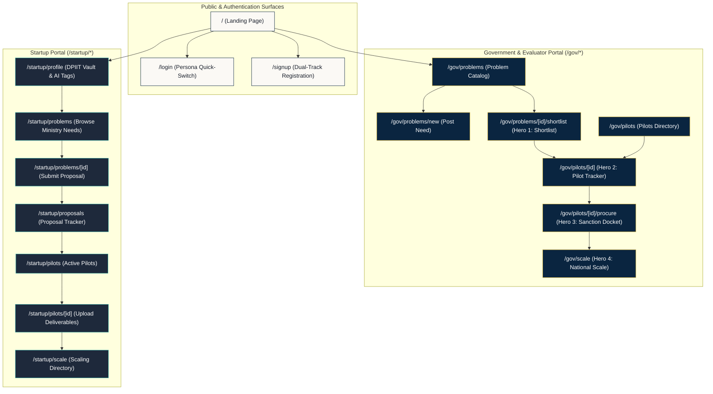

<div align="center">


# SAMARTH — Frontend Application
### Civic Editorial Web Interface · SIH26136

**Next.js 16 Client for Startups, Government Officers, and Technical Evaluators**

[](https://nextjs.org/)
[](https://www.typescriptlang.org/)
[](https://tailwindcss.com/)
[](https://nextjs.org/docs/app)
[](#3-civic-editorial-design-system)

</div>

---

## 1. Overview

The SAMARTH frontend is a high-performance civic web application built with **Next.js 16 (App Router)**, **TypeScript**, and **Tailwind CSS**. It provides specialized workspaces for three primary user personas:
1. **DPIIT Startups:** Manage institutional capabilities, browse ministry problem statements, submit technical proposals, and track milestone disbursements.
2. **Government Officers:** Publish departmental challenges, inspect explainable AI-shortlisted solutions, establish milestone-gated pilots, and issue direct GFR Rule 194 procurement orders.
3. **Independent Technical Evaluators:** Conduct objective 100-point rubric scoring and execute binding milestone verification audits.

---

## 2. Route Topology & Screen Hierarchy



---

## 3. Civic Editorial Design System

The application strictly implements the **Civic Editorial Design System**, replacing generic corporate software tropes with an authoritative aesthetic inspired by government gazettes, high-grade civic documents, and institutional integrity.

### 3.1 Color Tokens

```
  --surface          --surface-tint     --navy-deep        --gold-brass       --forest-verified
  #FBF9F5            #F4F0E8            #0A2540            #D4AF37            #138808
  [Parchment]        [Inset Surface]    [Sovereign Navy]   [GFR 194 Gold]     [Audit Verified]
```

| Token | CSS Variable | Hex Value | Usage |
|---|---|---|---|
| **Canvas** | `--surface` | `#FBF9F5` | Primary background parchment canvas |
| **Surface Accent** | `--surface-tint` | `#F4F0E8` | Table headers, inset drawers, active cards |
| **Sovereign Navy** | `--navy-deep` | `#0A2540` | Headers, primary buttons, authoritative framing |
| **Sovereign Gold** | `--gold-brass` | `#D4AF37` | Badges, highlight rings, GFR 194 sanction borders |
| **Verified Green** | `--forest-verified` | `#138808` | DPIIT verification seal, approved milestone tags |
| **Rubric Crimson** | `--crimson-rubric` | `#991B1B` | Warnings, failed milestone reports, rejection flags |
| **Civic Ink** | `--ink` | `#1A202C` | High-contrast body typography |
| **Muted Ink** | `--ink-muted` | `#64748B` | Timestamps, secondary labels, metadata stamps |
| **Divider Line** | `--line` | `#E2D9C8` | Fine parchment structural borders |

### 3.2 Typography Standards
- **Editorial Headings (`font-serif`):** `Fraunces` — Authoritative serif with optical sizing for titles, hero headers, and official dockets.
- **Interface Body (`font-sans`):** `Plus Jakarta Sans` — Crisp geometric sans-serif for forms, navigation controls, and data tables.
- **Cryptographic & Metric Data (`font-mono`):** `JetBrains Mono` — Tabular figures, SHA-256 audit hashes, currency amounts, and DPIIT registration codes.

### 3.3 Bespoke Vector Assets
All visual iconography is custom-crafted to match the civic editorial palette without relying on stock or placeholder graphics:
- `public/samarth-emblem.svg`: Vector national emblem with dual curved SVG text paths.
- `public/samarth-seal-verified.svg`: Circular verified green stamp for completed milestone certifications.
- `public/samarth-logo.svg`: Horizontal brand lockup for civic headers.
- `public/lifecycle-pipeline.svg`: Detailed 4-stage pipeline schematic.
- `public/dpiit-seal.svg`: Official DPIIT registration compliance marker.
- `public/empty-dossier.svg`: Bespoke empty state graphic for unpopulated lists.

---

## 4. Key UI Screens & Core Workflows

### 4.1 Hero Screen 1: Ranked Solution Shortlist (`/gov/problems/[id]/shortlist`)
- **Semantic Alignment Ring:** Displays AI match score percentage (e.g., `94% Match`).
- **Attributed Keywords:** Renders specific technical tags (`real-time edge inference`, `SWIR sensors`) explaining the rationale behind the ranking.
- **Solution Inspector Drawer:** Slide-out panel allowing officials to examine technical abstracts, claimed TRLs, and proposed budgets.
- **Evaluator Rubric Panel:** 100-point structured scoring rubric (Technical Merit, Cost Realism, Team Capability, Timeline Viability).

### 4.2 Hero Screen 2: Pilot Tracker & Milestone Stepper (`/gov/pilots/[id]`)
- **Milestone Stepper:** Visual timeline tracking phased deliverables across weeks.
- **Independent Validation Drawer:** Dedicated evaluation interface allowing accredited evaluators (e.g., IIT/NIT faculty) to verify raw telemetry proof, enter binding remarks, and approve or reject milestone tranches.
- **Tranche Disbursal:** One-click fund release for verified deliverables with automatic ledger timestamping.

### 4.3 Hero Screen 3: GFR Rule 194 Sanction Docket (`/gov/pilots/[id]/procure`)
- **Direct Sanction Generation:** Compiles all verified pilot data into a legal procurement package.
- **Sovereign Exemption Badge:** Visual confirmation under GFR Rule 194 (Startup Pilot Direct Exemption).
- **Cryptographic Audit Seal:** Displays SHA-256 hash stamp certifying the immutable integrity of the completed milestone trail.
- **Print Optimization:** Formatted with civic print stylesheets for physical signing and record archiving.

### 4.4 Hero Screen 4: National Scale Repository (`/gov/scale`)
- **Verified Innovation Directory:** Catalog of solutions that have completed pilots and earned sovereign procurement dockets.
- **Replication Modal:** Single-click form enabling external state or central departments to adopt proven technology without re-tendering.

---

## 5. Component Architecture

```
frontend/components/
├── domain/                      # Domain-specific civic workflows
│   ├── IndependentValidationDrawer.tsx  # Independent evaluator validation modal
│   ├── MilestoneCard.tsx                # Milestone deliverable & tranche card
│   ├── MilestoneStepper.tsx             # Visual progression stepper
│   ├── PilotSetupPanel.tsx              # Pilot initialization & tranche configurator
│   ├── RankedSolutionCard.tsx           # AI match score & keyword card
│   ├── ReplicationModal.tsx             # Inter-departmental adoption modal
│   ├── SanctionDocketView.tsx           # GFR Rule 194 legal sanction docket
│   ├── SolutionInspectorDrawer.tsx      # Slide-out proposal detail view
│   └── StartupTagList.tsx               # Interactive AI-extracted capability tags
│
├── layout/                      # Application shell & framing
│   ├── AppShell.tsx                     # Fixed-height viewport with isolated scroll
│   ├── PageHeader.tsx                   # Unified civic page header with breadcrumbs
│   ├── Sidebar.tsx                      # Fixed, non-scrollable role-aware navigation
│   └── TopHeader.tsx                    # Persona switcher & live session badge
│
└── ui/                          # Tactile design primitives
    ├── AuditStamp.tsx                   # Cryptographic SHA-256 verification seal
    ├── Badge.tsx                        # Contextual civic status pill
    ├── Button.tsx                       # Tactile button with primary, gold, & outline styles
    ├── Dialog.tsx                       # High-contrast modal dialog
    ├── Drawer.tsx                       # Accessible slide-out evaluation panel
    ├── Input.tsx                        # Form input with sovereign focus ring
    ├── SamarthEmblem.tsx                # Scalable SVG vector emblem
    ├── Select.tsx                       # Accessible dropdown selector
    └── Tabs.tsx                         # Segmented navigation switcher
```

---

## 6. Client State & Security Architecture

### 6.1 Edge Proxy Gating (`proxy.ts`)
Next.js Edge Proxy intercepts all dashboard requests before component hydration:
- `/startup/*` routes verify that the `samarth_session_role` cookie equals `"startup"`.
- `/gov/*` routes verify that the cookie equals `"govt_officer"`, `"evaluator"`, or `"admin"`.
- Unauthorized requests are redirected to `/login` with preserve-intent redirect queries.

### 6.2 Session Management (`lib/auth.ts`)
- Dual-layer session synchronization using `localStorage` and `document.cookie`.
- Reactive `useSyncExternalStore` subscription ensuring instant top-header re-rendering across tab instances without SSR hydration mismatches.

### 6.3 Unified API Client (`lib/api.ts`)
- Client-side persistence layer with pre-seeded governance mock data.
- Built-in simulation of document tag extraction, semantic scoring, milestone transitions, tranche disbursals, and cryptographic audit hashing.

---

## 7. Pre-Seeded Demonstration Personas

Use the **Persona Quick-Switcher** in the top navigation bar to test the application across different access levels:

| Name | Role Key | Department / Entity | Primary Demo Flow |
|---|---|---|---|
| **Dr. A. Sharma** | `govt_officer` | ICAR — Precision Agriculture | Review shortlist, initiate pilot, disburse tranches, release sanction docket |
| **Vikram Mehta** | `startup` | AeroKisan Technologies (`DIPP98234`) | Upload credentials, submit proposal, upload milestone deliverables |
| **Prof. K. Rao** | `evaluator` | IIT Delhi — Autonomous Systems | Score proposal rubrics, conduct independent milestone verification |

---

## 8. Local Setup & Verification

### 8.1 Installation & Startup
```bash
# Install dependencies
npm install

# Start development server
npm run dev
```
Navigate to [http://localhost:3000](http://localhost:3000) (or `http://localhost:3001` if port 3000 is occupied).

### 8.2 Production Build Verification
```bash
# Build production bundle with Turbopack
npm run build
```
Target build duration: `< 500ms` with zero TypeScript or lint errors across all 15 routes.

---

<div align="center">


<p><b>SAMARTH Frontend · Civic Editorial Interface</b></p>
<p><i>Smart India Hackathon 2026 · Problem Statement ID: SIH26136</i></p>

</div>
