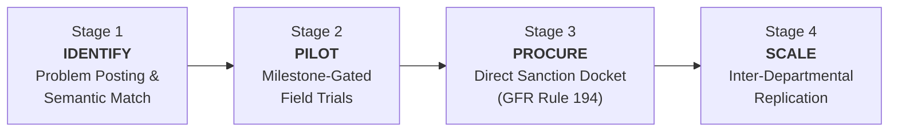
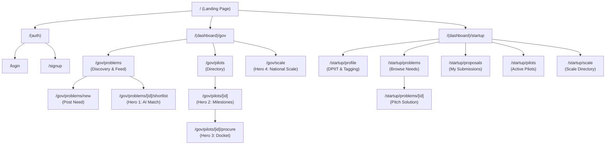
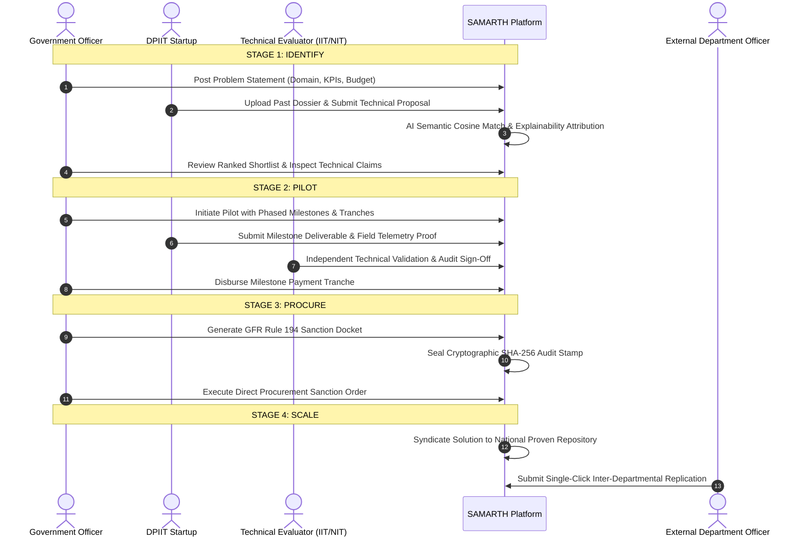

<div align="center">


# SAMARTH
### Sovereign AI-Assisted Milestone-governed Agile Regional Technology Harvesting

**A Public Procurement Lifecycle Engine for Startups and Government Entities**  
*Smart India Hackathon 2026 · Problem Statement ID: `SIH26136`*

[](https://nextjs.org/)
[](https://www.typescriptlang.org/)
[](https://tailwindcss.com/)
[](https://doe.gov.in/)
[](https://www.startupindia.gov.in/)

</div>

---

## 1. Executive Overview

**SAMARTH** is an institutional procurement platform engineered to solve the systemic disconnect between innovative DPIIT-recognized startups and public procurement ministries. Traditional public tenders impose prohibitive turnover and prior-experience thresholds, barring high-capability startups. 

SAMARTH implements a milestone-gated civic pipeline governed under **General Financial Rules (GFR Rule 194)**, transforming risky open-ended contracts into structured, time-boxed pilot validations that qualify directly for sovereign procurement and nationwide replication.



---

## 2. Frontend Architecture & Route Topology

The frontend is constructed using the **Next.js 16 App Router** with React Server Components, client-side state synchronizers, and edge proxy protection.



---

## 3. Four-Stage Procurement Lifecycle Flow



---

## 4. Role-Based Access Control (RBAC) Matrix

SAMARTH implements strict separation of concerns across four distinct civic roles:

| Module / Route | Startup (`startup`) | Government Officer (`govt_officer`) | Technical Evaluator (`evaluator`) | Platform Admin (`admin`) |
|---|:---:|:---:|:---:|:---:|
| **Public Landing & Portals** | Read | Read | Read | Read |
| **Startup Profile & Auto-Tags** | Read / Write | Read | Read | Read |
| **Post Problem Statement** | — | Read / Write | Read | Read / Write |
| **Ranked Solution Shortlist** | — | Read / Action | Read / Score Rubric | Read / Action |
| **Milestone Deliverable Upload** | Read / Write | Read | Read | Read |
| **Milestone Technical Validation** | — | Read | Read / Verify / Sign | Read / Verify |
| **Tranche Payment Disbursal** | View Status | Read / Action | — | Read / Action |
| **GFR 194 Sanction Docket** | View Status | Read / Issue Order | View Audit | Read / Issue |
| **National Scale Replication** | Read Directory | Request Replication | Read Directory | Full Manage |

---

## 5. Civic Editorial Design System

SAMARTH departs from generic corporate dashboards and unstyled government utilities, adopting a bespoke **Civic Editorial** aesthetic rooted in authoritative typography, parchment surfaces, and sovereign accents.

### 5.1 Palette Tokens

| Token | CSS Variable | Hex Value | Semantic Purpose |
|---|---|---|---|
| **Parchment Surface** | `--surface` | `#FBF9F5` | Main warm civic reading canvas |
| **Parchment Accent** | `--surface-tint` | `#F4F0E8` | Table headers, inset cards, active tabs |
| **Sovereign Navy** | `--navy-deep` | `#0A2540` | Primary brand authority, buttons, headers |
| **Civic Ink** | `--ink` | `#1A202C` | High-contrast editorial body text |
| **Muted Ink** | `--ink-muted` | `#64748B` | Secondary captions, metadata stamps |
| **Sovereign Gold** | `--gold-brass` | `#D4AF37` | Badges, highlight borders, GFR Rule 194 marks |
| **Verified Green** | `--forest-verified`| `#138808` | DPIIT verified seals, completed milestone stamps |
| **Rubric Crimson** | `--crimson-rubric` | `#991B1B` | Warnings, failed verifications, critical flags |

### 5.2 Typography Standards
- **Display & Headings:** `Fraunces` — Authoritative editorial serif reflecting government gazette precision.
- **Interface & Form Controls:** `Plus Jakarta Sans` — Clean, legible modern sans-serif.
- **Audit Trails & Numeric Data:** `JetBrains Mono` — Monospaced layout for file hashes, DPIIT registration codes, and currency figures.

---

## 6. Directory Structure

```
frontend/
├── app/
│   ├── (auth)/                  # Session entry points
│   │   ├── login/page.tsx       # Multi-persona civic login
│   │   └── signup/page.tsx      # Dual-track registration (Startup / Govt)
│   ├── (dashboard)/             # Protected portal layouts
│   │   ├── gov/                 # Government & Evaluator workspace
│   │   │   ├── pilots/          # Pilot tracking & Hero 2 milestone stepper
│   │   │   │   └── [id]/procure # Hero 3: GFR Rule 194 Sanction Docket
│   │   │   ├── problems/        # Problem discovery & posting
│   │   │   │   └── [id]/shortlist # Hero 1: AI semantic match shortlist
│   │   │   └── scale/           # Hero 4: National replication repository
│   │   └── startup/             # Startup innovation workspace
│   │       ├── pilots/          # Active pilot tracker & deliverable uploads
│   │       ├── problems/        # Problem statement catalog & proposal submission
│   │       ├── profile/         # DPIIT credential vault & AI tag extraction
│   │       ├── proposals/       # Proposal history & rubric reviews
│   │       └── scale/           # Scaling registry view
│   ├── icon.svg                 # Sovereign emblem web favicon
│   ├── layout.tsx               # Root application wrapper & font injection
│   └── page.tsx                 # Public homepage & pipeline explainer
├── components/
│   ├── domain/                  # Mission-critical business components
│   │   ├── IndependentValidationDrawer.tsx
│   │   ├── MilestoneCard.tsx
│   │   ├── MilestoneStepper.tsx
│   │   ├── PilotSetupPanel.tsx
│   │   ├── RankedSolutionCard.tsx
│   │   ├── ReplicationModal.tsx
│   │   ├── SanctionDocketView.tsx
│   │   ├── SolutionInspectorDrawer.tsx
│   │   └── StartupTagList.tsx
│   ├── layout/                  # Navigation & shell containers
│   │   ├── AppShell.tsx         # Fixed-frame responsive layout engine
│   │   ├── PageHeader.tsx       # Standardized civic page header
│   │   ├── Sidebar.tsx          # Role-filtered vertical navigation
│   │   └── TopHeader.tsx        # Persona quick-switcher & live banner
│   └── ui/                      # Base civic design tokens & primitives
│       ├── AuditStamp.tsx       # Cryptographic verification seal
│       ├── Badge.tsx            # Contextual status badges
│       ├── Button.tsx           # Standardized tactile civic buttons
│       ├── Dialog.tsx           # High-contrast modal dialog
│       ├── Drawer.tsx           # Accessible slide-out evaluation canvas
│       ├── Input.tsx            # Form input with sovereign focus rings
│       ├── SamarthEmblem.tsx    # Scalable vector emblem with SVG text arcs
│       ├── Select.tsx           # Form select element
│       └── Tabs.tsx             # Tabbed navigation switcher
├── lib/
│   ├── api.ts                   # Unified API client & state store
│   ├── auth.ts                  # Session handling & persona switcher
│   ├── seedData.ts              # Pre-seeded Indian governance dataset
│   └── types.ts                 # Authoritative TypeScript domain definitions
├── proxy.ts                     # Next.js Edge proxy protecting dashboard routes
└── tailwind.config.ts           # Civic Editorial design token declarations
```

---

## 7. Local Development & Setup

### 7.1 Prerequisites
- **Node.js:** `v18.17.0` or higher
- **Package Manager:** `npm` (`v9.0.0` or higher)

### 7.2 Installation & Startup

1. **Clone the repository and enter the frontend directory:**
   ```bash
   cd frontend
   ```

2. **Install project dependencies:**
   ```bash
   npm install
   ```

3. **Launch the development server:**
   ```bash
   npm run dev
   ```
   Open [http://localhost:3000](http://localhost:3000) (or `http://localhost:3001` if port 3000 is occupied).

4. **Verify TypeScript & Production Build:**
   ```bash
   npm run build
   ```
   The build pipeline executes in `< 500ms` via Turbopack with zero warnings.

---

## 8. Pre-Seeded Demonstration Personas

SAMARTH provides three pre-configured accounts selectable from the top navigation bar for immediate workflow evaluation:

1. **Dr. A. Sharma** (`sharma.icar@gov.in`)
   - **Role:** `govt_officer`
   - **Entity:** Indian Council of Agricultural Research (ICAR)
   - **Focus:** Division of Precision Agriculture & Drone Systems

2. **Vikram Mehta** (`vikram@aerokisan.tech`)
   - **Role:** `startup`
   - **Entity:** AeroKisan Technologies Pvt Ltd (DPIIT: `DIPP98234`)
   - **Focus:** Autonomous UAVs & SWIR Seepage Sensing

3. **Prof. K. Rao** (`krao@iitd.ac.in`)
   - **Role:** `evaluator`
   - **Entity:** Indian Institute of Technology Delhi
   - **Focus:** Department of Aerospace & Autonomous Robotics

---

<div align="center">


<p><b>SAMARTH Platform · Smart India Hackathon 2026</b></p>
<p><i>Compliant with General Financial Rules (GFR Rule 194) and DPIIT Startup Procurement Framework</i></p>

</div>
